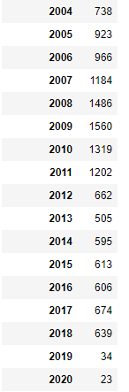

# Video Game Sales Project
## This project is broken up into 3 parts
### 1) Jupyter Notebook project that uses the library BeautifulSoup to scrape the website 'vgchartz.com' and takes a look at video game sales data from the period of 1978-2020. 2) Scraped data will then be cleaned up using the Pandas library, making sure the dataset is usable and coherent. 3) We will then perform an EDA (Exploratory Data Analysis) on the cleaned data in order to try and draw useful insights on the trends of video game sales throughout its history.

### If you are interested in taking a look at my thought process in its rawest form, you can view each of my python notebook files seperated by 3 parts (Web Scraping, Data Cleaning, EDA)

### Here were some of my findings
### First let's take a look at a snapshot of the structure of the finalized data frame:

#### The dataframe consisted of 17,862 entries after cleaning.
### Before committing to the EDA, I decided to try and get a better idea of the data by creating frequency distribution tables of genres, consoles, publishers, release years, and titles
#### Genre Frequency Dist. Table

#### Console Frequency Dist. Table

#### Release Year Frequency Dist. Table

#### Publisher Frequency Dist. Table

### Through these ditribution tables I got a good idea of the distributions of the qualitative types of data, however for the quantative types of data which include Total Sales, NA Sales, EU Sales, JP Sales, and Other Sales, I created histograms to better understand their distributions.

#### This distribution for Total Sales is also representative of the sales that came from specific country groupings. Overall, we can see that most of the games that were published made anywhere from a few thousand to under 2 mil in sales while the top 1% made anywhere from 2 mil to tens of millions in sales.

### Following the distribution analysis, we began to start an official EDA, starting with finding the Top 10 Best Seelling Games worldwide and also in individual country groupings including NA, EU, etc.

### We next, we wanted to find the Total Sales values when seperated by the genre, console, and publisher of the game.

### The next task we tackled was to take a look at the Total Sales values seperated by country grouping over the time period of (1978-2020). For this, we chose to use a multi lined graph to span over the years.

### We then tried to get a more detailed look at the Total Sales values by Console, Genre, and Publisher, howveer this time seperated by country grouping. For this, we chose to use stacked bar graphs.

