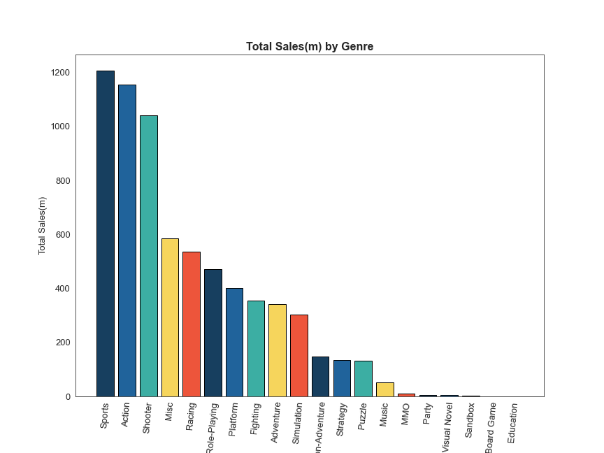

# Video Game Sales Project
## This project is broken up into 3 parts
### 1) Jupyter Notebook project that uses the library BeautifulSoup to scrape the website 'vgchartz.com' and takes a look at video game sales data from the period of 1978-2020. 2) Scraped data will then be cleaned up using the Pandas library, making sure the dataset is usable and coherent. 3) We will then perform an EDA (Exploratory Data Analysis) on the cleaned data in order to try and draw useful insights on the trends of video game sales throughout its history.

### If you are interested in taking a look at my thought process in its rawest form, you can view each of my python notebook files seperated by 3 parts (Web Scraping, Data Cleaning, EDA)

### Here were some of my findings
### First let's take a look at a snapshot of the structure of the finalized data frame:

#### The dataframe consisted of 17,862 entries after cleaning.
### Before committing to the EDA, I decided to try and get a better idea of the data by creating frequency distribution tables of genres, consoles, publishers, release years, and titles

